# Serverless Deployment

In this tutorial, you will deploy a translation function, share a locally tested
web app, give that app access to a cloud speech model, and run the same processing
as a job that saves its results.

The translation model is provided by an external service. We are deploying the
**application code around the model**, not training or hosting the translation
model ourselves. This is the same application role we will need in the Cheese
App: accept input, call a model service, and return a result.

| Part | What you do | New idea |
| --- | --- | --- |
| [1. Deploy a function](#part-1-deploy-a-translation-function) | Call a URL with text and language parameters | Supply code; Google builds the runnable image |
| [2. Deploy a web app](#part-2-deploy-a-translation-web-app) | Move a working local UI to a public URL | Deploy an existing container image |
| [3. Add speech](#part-3-give-the-web-app-access-to-agent-platform) | Play the translation as audio | Give a runtime identity permission to call Agent Platform |
| [4. Run a job](#part-4-generate-and-save-a-translated-audio-edition) | Translate a passage and save text and audio | Run finite work and keep its output in Storage |

**Follow the console steps first.** The expandable **Equivalent gcloud commands**
sections are alternative ways to perform the same actions, not additional steps
to run after creating the same resources in the console. Expand **More detail**
when you want to understand what is happening underneath. GIF headers use the
local list number on the same line as the description, such as
**Step 2 — Select the service account**.

## Before you begin

1. Open the [Google Cloud console](https://console.cloud.google.com/) and select
   **your course project** using the project selector at the top. Check the
   **project ID**, not only its display name. Use your own project and buckets
   when following along; instructor resources are examples.
2. Confirm billing is enabled and that you can create Cloud Run resources,
   service accounts, and buckets and grant their required permissions. If the
   course project restricts these actions, resolve that with course staff first.
3. Choose a Cloud Run region. These instructions use **Toronto
   (`northamerica-northeast2`)**. The speech model uses **`us-central1`**; that is
   a separate setting we introduce in part 3.
4. Clone or download the [tutorial branch](https://github.com/dlops-io/serverless-deployment/tree/codex/four-part-tutorial). Use the repository root as the working
   directory for terminal examples. Docker is needed for the local demonstration
   in part 2. Python and the Google Cloud CLI are needed for the local helper in
   part 4. Deploying a prebuilt image through the console does not require Docker.

Use these names as a worksheet. Resource names can be different if you carry
those choices through the later steps.

| Setting | Value used in this walkthrough |
| --- | --- |
| Function service | `translate-function` |
| Web service | `translation-demo` |
| Web runtime account | `translation-demo-runtime` |
| Job | `translation-audio` |
| Job runtime account | `translation-audio-job` |
| Input bucket | A globally unique name you choose in part 4 |
| Output bucket | A second globally unique name you choose in part 4 |

The public image used in parts 2–4 is:

```text
cgumb/ac215-translation-demo:lecture14-agent-platform-20261022
```

You do not need to build or publish an image to follow the tutorial. The source,
Dockerfile, and application CLI are available for optional inspection in
[`tutorial/app/`](tutorial/app/).

<details>
<summary>Terminal setup — run once before using any gcloud command boxes</summary>

Install the [Google Cloud CLI](https://docs.cloud.google.com/sdk/docs/install).
Run this in your local terminal, replacing the project ID. Cloud Shell already
has gcloud installed and normally uses your console identity.

```bash
gcloud auth login
export PROJECT_ID=YOUR_PROJECT_ID
export REGION=northamerica-northeast2
export IMAGE=cgumb/ac215-translation-demo:lecture14-agent-platform-20261022
export WEB_SERVICE=translation-demo
export JOB_NAME=translation-audio
export WEB_EMAIL="translation-demo-runtime@${PROJECT_ID}.iam.gserviceaccount.com"
export JOB_EMAIL="translation-audio-job@${PROJECT_ID}.iam.gserviceaccount.com"
```

Keep this terminal open for the command alternatives. Commands use an explicit
project flag so they do not depend on a different globally selected project.
This CLI login lets gcloud operate on your project. It does **not** set up the
application's local ADC; we introduce that in part 3.

</details>

## Part 1: Deploy a translation function

Start with the smallest possible app: receive text and language parameters,
call the translation provider, and return translated text. You supply a Python
handler and its dependencies. Google builds and runs the container for you.

### 1.1 Create the function

1. In the console, open **Cloud Run → Services** and select **Write a function**.
   This opens **Create service**. On a narrow window, **Write a function** is
   under the toolbar’s **More actions** menu.
2. If prompted to enable required APIs, enable them and return to the form.
3. Set **Service name** to `translate-function` and choose your region.
4. In **Runtime**, select **Python 3.12**.
5. Under **Authentication**, select **Allow public access** for this classroom
   endpoint, then select **Create**.
6. Wait for the service to be created. Open its **Source** editor if the console
   does not take you there automatically. The initial service can contain sample
   code; we replace that next.

<details open>
<summary>Watch GIF — function setup, steps 1–6</summary>

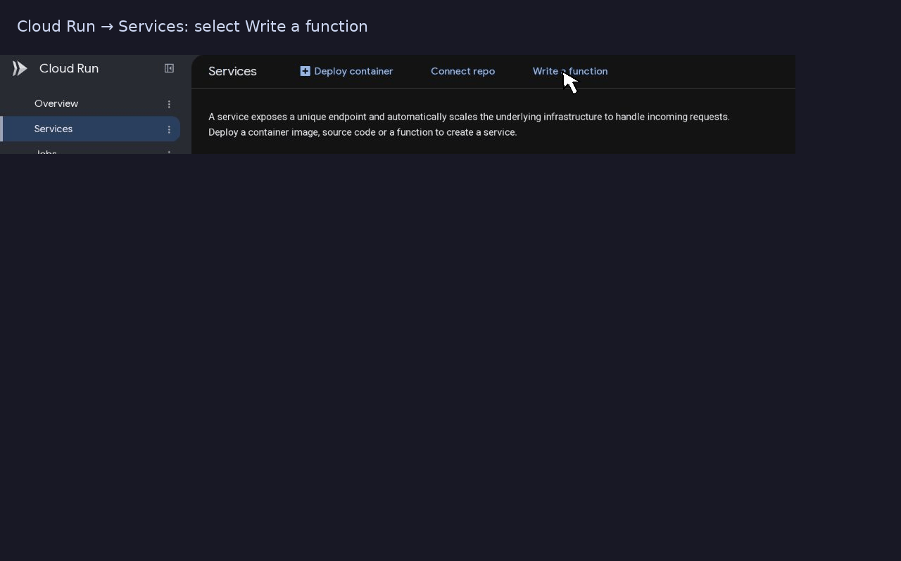

The pointer and click rings are added guides over real screenshots, rather than
continuous video. This records an actual public function creation through
**Create** and the resulting **Source** editor. API enablement is conditional;
our project already had the required APIs enabled. Build waiting time is
shortened. Check the name, region, and runtime rather than accepting defaults.

</details>

### 1.2 Supply the code and dependencies

1. In **Source**, select **Edit source** if the editor is read-only. Replace
   `main.py` with the contents of
   [`tutorial/function/main.py`](tutorial/function/main.py):

   ```python
   import functions_framework
   from googletrans import Translator

   @functions_framework.http
   def hello_http(request):
       text = request.args.get("text", "Welcome to AC215")
       source = request.args.get("src", "en")
       destination = request.args.get("dest", "es")
       return Translator().translate(text, src=source, dest=destination).text
   ```

2. Replace `requirements.txt` with
   [`tutorial/function/requirements.txt`](tutorial/function/requirements.txt):

   ```text
   functions-framework==3.10.2
   googletrans==4.0.0rc1
   ```

3. Set the **Function entry point** to `hello_http`. This is the Python function
   the serving framework should call, not the filename or service name.
4. Select **Save and redeploy**. Wait for the revision to become ready.

### 1.3 Call the endpoint

1. Return to **service details** and copy the **URL** near the top. The build
   details page describes a build; the service page gives the application URL.
2. Open your URL in a browser. With no arguments, it translates the default text
   from English to Spanish.
3. Append the following query string to **your** URL:

   ```text
   ?text=Good%20afternoon%20everyone&src=en&dest=fr
   ```

4. Change `dest=fr` to `dest=el` or `dest=hi` and try again. For Chinese, use
   `dest=zh-cn` for Simplified Chinese.
5. Open **Observability → Logs** in service details and find the requests you
   just made. Confirm an HTTP **200** response for the translation request.

**Checkpoint:** the same endpoint accepts different inputs without a redeploy.
The question mark begins the query string; ampersands separate its parameters.
The `src` and `dest` parameters identify languages, not cloud regions.

<details open>
<summary>Watch GIF — source files, deployment, and live response</summary>


These screenshots from the console rehearsal show the handler, dependencies,
completed rollout, and live response, with added pointer and click guides.
Build waiting time is omitted. The
translation request returned **Bonjour à tous**, and its request log showed
HTTP **200**.

</details>

<details>
<summary>Equivalent gcloud commands — deploy and call the function</summary>

Use the terminal setup above. Source deployment may prompt you to enable APIs or
create a build repository in a new project.

```bash
gcloud run deploy translate-function \
  --project="$PROJECT_ID" --region="$REGION" \
  --source=tutorial/function --function=hello_http --base-image=python312 \
  --no-invoker-iam-check

FUNCTION_URL=$(gcloud run services describe translate-function \
  --project="$PROJECT_ID" --region="$REGION" --format='value(status.url)')
curl --get "$FUNCTION_URL" \
  --data-urlencode 'text=Good afternoon everyone' \
  --data-urlencode 'src=en' --data-urlencode 'dest=fr'
```

</details>

<details>
<summary>More detail — what is being built, and what is a cold start?</summary>

Open the deployment's build details. The build process receives your source,
uses Google's build tooling to assemble a Python environment, installs the
requirements, configures the Functions Framework, and publishes an application
image in Artifact Registry. It does not infer all dependencies from imports.
Dependency installation happens at **build time**, not on every request.

Cloud Run routes requests to application instances and can start additional
instances when needed. A cold start initializes an instance of the built
application; it does not necessarily boot a new VM dedicated to your request.
Scaling to zero applies to app instances, while Google's routing infrastructure
remains available. There is no fixed inactivity interval to rely on as a
prediction of the next cold start. Minimum-instance settings can keep capacity
warm when that matters.

The default text translation here uses `googletrans`, a wrapper around an
external translation service. It is independent of the Agent Platform speech call we
add later. Provider failures and quotas can affect a demo; inspect logs rather
than treating a completed build as proof that translation worked.

[Function deployment reference](https://docs.cloud.google.com/run/docs/quickstarts/functions/deploy-functions-console).

</details>

## Part 2: Deploy a translation web app

Now imagine you already have a working containerized web app on your laptop.
It has text boxes, language selectors, and a Translate button. Sharing
`localhost` does not make it available on another person's computer. We will
deploy that existing image and give the app a public URL.

### 2.1 Try the prebuilt app locally

1. With Docker running, open a local terminal and run:

   ```bash
   docker run --rm -p 8086:8080 \
     cgumb/ac215-translation-demo:lecture14-agent-platform-20261022
   ```

2. Open [http://localhost:8086](http://localhost:8086).
3. Enter a short sentence, choose source and destination languages, and select
   **Translate**. The translated text appears in the other box.
4. Notice that **Play audio** is disabled. We introduce the identity and speech
   permissions in part 3. Stop the local container with **Ctrl+C** when finished.

If you are following only the console demonstration, you can observe the
instructor's local run and continue to the next step.

<details open>
<summary>Watch GIF — try the prebuilt container locally</summary>

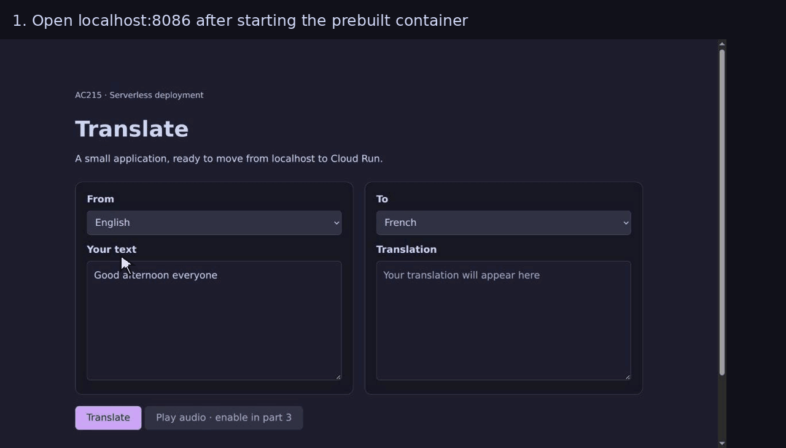

This is the image running on **localhost:8086**, with no speech credentials or
speech setting. The same image is deployed to Cloud Run next.

</details>

### 2.2 Deploy the same image

1. Open **Cloud Run → Services → Deploy container**.
2. On **Create service**, select **Deploy one revision from an existing
   container image**. In **Container image URL**, paste:

   ```text
   cgumb/ac215-translation-demo:lecture14-agent-platform-20261022
   ```

3. Set **Service name** to `translation-demo` and choose your region.
4. Select **Allow public access** and **Request-based** billing.
5. Under service scaling, use **Auto scaling**, **Minimum number of instances** `0`, and
   **Maximum number of instances** `2` for this demo.
6. Expand **Containers, Networking, Security**. Under **Containers → Edit
   Container → Settings**, verify **Container port** `8080`, **Memory**
   **512 MiB**, and **CPU** `1`. Leave the image’s command and arguments
   unchanged. Select **Done** to close the container editor.
7. Under **Requests**, set **Request timeout** to `120` seconds and
   **Maximum concurrent requests per instance** to `4`. These settings match
   the command alternative below. Do not add speech variables yet.
8. Select **Create** and wait until the service is ready.
9. Copy its **URL**, open the page, and repeat your local translation. Speech
   should still be disabled.
10. Return to service details and open **Revision History**, then
    **Observability → Logs**. A revision is a deployed version of the service’s
    image and configuration.

<details open>
<summary>Watch GIF — create the container service and verify it</summary>

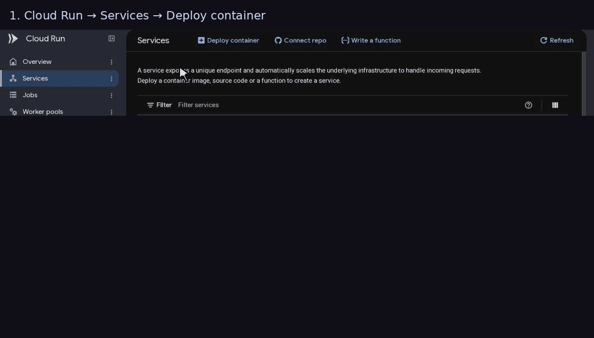

This shows public service creation through **Done**, **Create** and completed
rollout, plus revision/log inspection. The successful translation was recaptured
later at the same public URL, temporarily disabling speech on the configured
service to show the Part 2 UI. Translation does not use the runtime identity.
The HTTP 200 log is from the earlier rehearsal, not that recaptured request.
These are real Console screenshots with added pointer and click rings; they
combine separate rehearsal sessions and shorten waiting. Keep the same image;
no source build is needed.

</details>

**Checkpoint:** someone else can use the app through its cloud URL. We supplied
an already-built image, so this deployment did not need to build our source.

<details>
<summary>Equivalent gcloud commands — deploy the container service</summary>

```bash
gcloud run deploy "$WEB_SERVICE" \
  --project="$PROJECT_ID" --region="$REGION" --image="$IMAGE" \
  --no-invoker-iam-check --min-instances=0 --max-instances=2 \
  --cpu=1 --memory=512Mi --concurrency=4 --timeout=120
```

This creates the part 2 service. If you are rerunning the tutorial with an
existing service that already has speech enabled, remove its `ENABLE_SPEECH`
setting to restore the part 2 behavior.

</details>

<details>
<summary>More detail — why use a container, and can a web UI scale to zero?</summary>

A function could also return HTML and implement this interface. The reason for
using a container is that we already packaged and tested an app and want to
carry that image into deployment. Custom images also give us control over system
libraries, startup commands, and application structure when needed.

The browser keeps displaying HTML and running client-side code after the server
responds. Selecting Translate sends another HTTP request; the app returns JSON
that updates the page. The container does not need to remain dedicated to that
browser between interactions. Successive requests can reach different instances.

The Cloud Run application is our **application backend**. That means server-side
application logic behind the interface, not the last service in a chain. It can
expose a public API and call other services. Here the flow is browser → our app →
external translation provider → our app → browser.

[Container deployment reference](https://docs.cloud.google.com/run/docs/deploying).

</details>

## Part 3: Give the web app access to Agent Platform

Keep the same app and translation provider. This time, enable **Play audio**.
The app will call Gemini text-to-speech through Agent Platform and return audio to
the waiting browser. This requires an authorized identity, not an output bucket.

Two permissions questions are separate: **who may call our public app**, and
**what the running app may access**. A service account answers the second one.

### 3.1 Enable the API and create the app's identity

1. In **APIs & Services → Library**, find **Agent Platform API** and enable it in your
   project if it is not already enabled.
2. Open **IAM & Admin → Service Accounts → Create service account**.
3. Set **Service account name** to `Translation demo runtime` and
   **Service account ID** to `translation-demo-runtime`.
   Its email will be `translation-demo-runtime@YOUR_PROJECT_ID.iam.gserviceaccount.com`.
   **Service account description** is optional; the recording uses
   “Calls Gemini speech for the translation app”.
4. Select **Create and continue**. In **Permissions (optional)**, add
   **Agent Platform User**, then **Add another role → Service Usage Consumer**.
   The first grants model access; the second permits API quota/billing. Select
   **Continue** to reach **Principals with access (optional)**. Leave both
   **Service account users role** and **Service account admins role** empty,
   then select **Done**. We add your developer access separately in section 3.3.
5. Record the account email. You do not need to create or download a key.

The **Agent Platform User** role uses the ID `roles/aiplatform.user` in the
command alternatives. The **Agent Platform API** service ID is
`aiplatform.googleapis.com`.

<details>
<summary>If the API is already enabled</summary>

The API’s product page shows **Agent Platform API** and **API Enabled**. Continue
with account creation; do not disable it just to repeat this step. In a new
project, select **Enable** and wait for completion before proceeding.

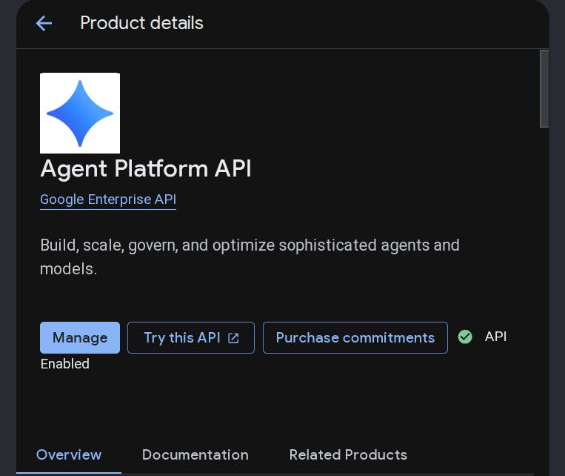

</details>

<details open>
<summary>Watch GIF — create and inspect the runtime identity</summary>

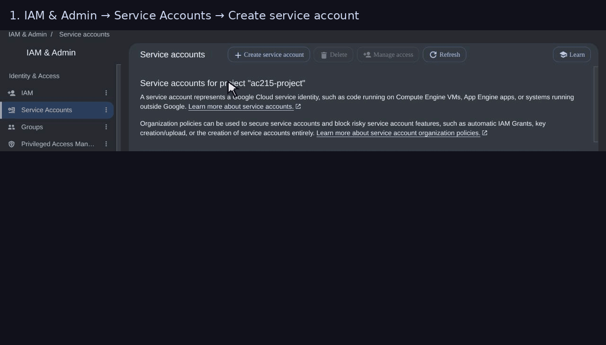

This records actual account creation: **Create and continue**, both project
roles, **Continue**, and final **Done**. The resulting account has no keys.
API enablement is conditional and was already complete in this project.

</details>

<details>
<summary>Equivalent gcloud commands — create the speech runtime identity</summary>

```bash
gcloud services enable aiplatform.googleapis.com --project="$PROJECT_ID"
gcloud iam service-accounts create translation-demo-runtime \
  --project="$PROJECT_ID" --display-name='Translation demo runtime'
gcloud projects add-iam-policy-binding "$PROJECT_ID" \
  --member="serviceAccount:$WEB_EMAIL" --role=roles/aiplatform.user --condition=None
gcloud projects add-iam-policy-binding "$PROJECT_ID" \
  --member="serviceAccount:$WEB_EMAIL" \
  --role=roles/serviceusage.serviceUsageConsumer --condition=None
```

Creating accounts, granting their permissions, and attaching them require your
caller identity to have the corresponding administrative rights. Attaching an
account requires `iam.serviceAccounts.actAs`, commonly provided by **Service
Account User** on that account. These are your deployment permissions, separate
from the account's runtime permissions.

</details>

### 3.2 Attach the identity and enable speech

Your signed-in deployment identity needs **Service Account User**
(`iam.serviceAccounts.actAs`) on the runtime account to attach it. This is
separate from the runtime account’s model permissions.

1. Return to **Cloud Run → Services → translation-demo**.
2. Open the **Security** tab. Under **Service Account**, choose your runtime
   identity in the **Service account** selector. Check its email against the
   account you created in section 3.1.
3. Open **Containers** and find **Variables & Secrets → Environment
   variables**. Fill the empty **Name 1 / Value 1** row, then select
   **Add variable** for each of the other two rows:

   | Name | Value |
   | --- | --- |
   | `ENABLE_SPEECH` | `true` |
   | `GOOGLE_CLOUD_PROJECT` | Your project ID |
   | `GOOGLE_CLOUD_LOCATION` | `us-central1` |

4. Select **View diff & redeploy**. In **Review
   changes to be deployed**, check the new environment variables and leave
   **Serve this revision immediately** selected. Select **Deploy changes**.
5. Wait for updating the service, creating the revision, and routing traffic to
   finish.
6. Reload the app's URL. Translate a short English sentence into French, then
   select **Play audio**. Use the browser's audio controls to replay it.
7. If the request fails, read the message shown in the UI and inspect the
   service's **Logs** before changing permissions.

**Checkpoint:** the app can call an authenticated cloud API using its attached
service account. Audio is returned directly to the browser; no audio files have
to be saved to a bucket in this part.

<details open>
<summary>Watch GIF — runtime identity and speech environment settings</summary>

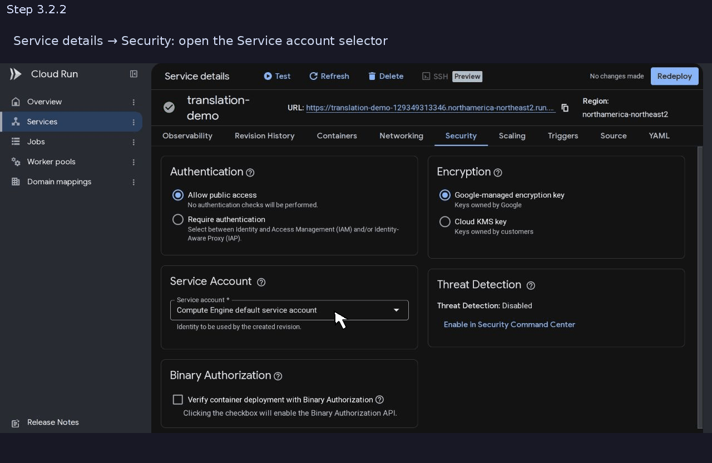

This records changes to the existing service: select the runtime identity, add
all three variables, review the diff, and deploy the changes. Pointer movement
and click rings are added guides; rollout waiting time is shortened.

</details>

<details open>
<summary>Watch GIF — verify translation and browser audio</summary>

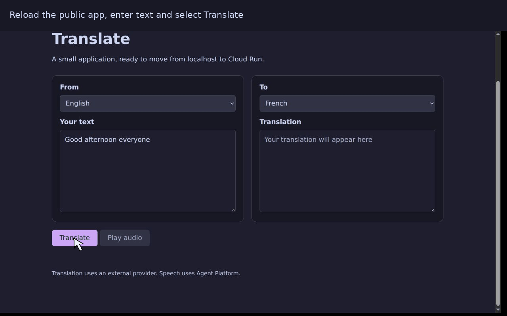

This is the live web app after part 3 is configured. Audio becomes available
only after speech is enabled. Pointer movement and click rings are added guides.

</details>

<details>
<summary>Equivalent gcloud commands — attach the account and enable speech</summary>

```bash
gcloud run services update "$WEB_SERVICE" \
  --project="$PROJECT_ID" --region="$REGION" \
  --service-account="$WEB_EMAIL" \
  --update-env-vars="ENABLE_SPEECH=true,GOOGLE_CLOUD_PROJECT=$PROJECT_ID,GOOGLE_CLOUD_LOCATION=us-central1"
```

The service region and model location are different settings. We rehearsed this
with the service in Toronto and the speech model in `us-central1`. The defaults
are `gemini-2.5-flash-tts` and voice `Kore`. Model availability, language support,
and quota depend on the selected model/location.

[Gemini TTS reference](https://docs.cloud.google.com/text-to-speech/docs/gemini-tts).

</details>

### 3.3 How would you develop this locally?

You should not need to publish an image for every code edit. Run Python locally,
call the real API, debug, then test the container and deploy once the behavior
works. **Application Default Credentials (ADC)** lets the same code discover
credentials locally and on Cloud Run.

To test the runtime account's actual permissions, your local app can
**impersonate that service account**. You sign in as yourself, with permission
to obtain temporary credentials as the account. This avoids downloading its
private key. Cloud Run obtains credentials from the attached identity instead.

<details>
<summary>Try it locally — service account impersonation and ADC</summary>

First grant your developer user **Service Account Token Creator** on the web
runtime account: **IAM & Admin → Service Accounts → translation-demo-runtime →
Principals with access → Grant access**. In **New principals**, enter your user
email. Under **Assign roles → Role**, select **Service Account Token Creator**.
Replace any preselected role; do not leave **Service Account Admin** assigned.
Then select **Save**. Enable the **IAM Service Account Credentials API** under
**APIs & Services → Library** if it is not already enabled.

<details open>
<summary>Watch GIF — allow your developer identity to impersonate the runtime account</summary>

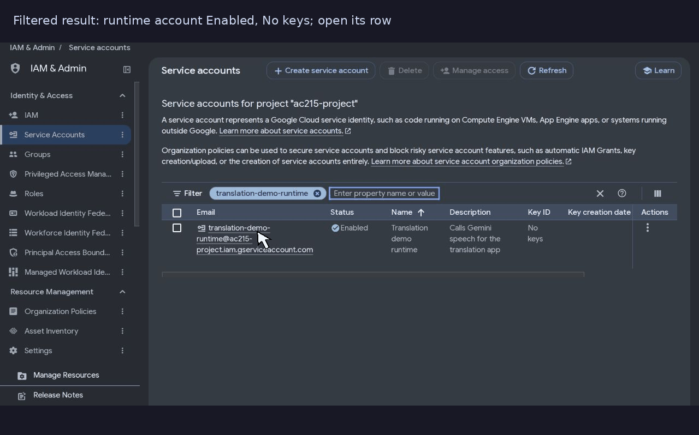

This records an actual grant through **Save** on the new runtime account. Enter
your own user email rather than copying the instructor’s identity. Interactive
sign-in and credential files are deliberately excluded from recordings.

</details>

Equivalent commands, followed by the interactive application login:

```bash
export DEVELOPER_EMAIL=YOUR_GOOGLE_ACCOUNT_EMAIL
gcloud services enable iamcredentials.googleapis.com --project="$PROJECT_ID"
gcloud iam service-accounts add-iam-policy-binding "$WEB_EMAIL" \
  --project="$PROJECT_ID" --member="user:$DEVELOPER_EMAIL" \
  --role=roles/iam.serviceAccountTokenCreator --condition=None

gcloud auth application-default login --impersonate-service-account="$WEB_EMAIL"
gcloud auth application-default set-quota-project "$PROJECT_ID"
```

Complete the browser sign-in. The ADC file stays on your machine; it does not go
into Git or the image. Your developer user needs permission to use the selected
quota project as well. In a restricted project, course staff may need to grant
**Service Usage Consumer** to your developer identity.

With [uv](https://docs.astral.sh/uv/) installed, run the app directly:

```bash
cd tutorial/app
uv sync --frozen
ENABLE_SPEECH=true GOOGLE_CLOUD_PROJECT="$PROJECT_ID" \
  GOOGLE_CLOUD_LOCATION=us-central1 PORT=8086 \
  uv run python -m translation_demo serve
```

Open [http://localhost:8086](http://localhost:8086), translate, and play audio.
Edit code and restart locally; a new cloud deployment is not needed for each
edit. Run `cd ../..` when you return to repository-root commands below.

For container credential mounts, rootless Docker permissions, authentication
troubleshooting, and build/publish steps, use the
[development guide](tutorial/app/README.md#local-development-against-gcp).
Local identity tests do not reproduce every cloud networking or deployment
setting, so still verify the deployed app.

[Google's local ADC guide](https://docs.cloud.google.com/docs/authentication/set-up-adc-local-dev-environment).

</details>

## Part 4: Generate and save a translated audio edition

For an interactive web request, a person waits for the response. Now imagine
preparing a translated audio edition of a passage to collect later. The program
should read its input, translate it, generate speech, save the files, and exit.
That is a **job**, rather than an HTTP service waiting for requests.

We use the **same image** and the **same translation and speech code**. The new
pieces are its finite startup command and persistent files in Cloud Storage.
Work through the setup, then run it once from the console before using the CLI
or helper. The small passage finishes quickly, but the pattern also applies to
longer unattended work.

### 4.1 Create your input and output buckets

1. Open **Cloud Storage → Buckets** and select **Create** (the create-bucket action).
2. In **Get started**, choose a globally unique input bucket name, such as your
   project ID plus `-translation-input`. Record the name and select **Continue**.
3. Complete each section of the bucket wizard:
   - **Choose where to store your data:** select **Region**, choose your region
     (we use **northamerica-northeast2 (Toronto)**), then **Continue**.
   - **Choose how to store your data:** keep **Set a default class → Standard**.
     Leave **Enable Hierarchical namespace on this bucket** unchecked. Scroll
     to **Continue** and select it.
   - **Choose how to control access to objects:** keep **Enforce public access
     prevention on this bucket** checked and **Uniform** selected. Scroll to
     **Continue** and select it.
   - **Choose how to protect object data:** keep **Soft delete policy (For data
     recovery)** and **Use default retention duration**. Leave **Object versioning
     (For version control)** and **Retention (For compliance)** unchecked.
   Scroll to **Create** and select it. In **Public access will be prevented**,
   preserve the checkbox and select **Confirm**. On the created bucket's
   **Configuration** tab, check its region and Standard storage. The bucket header should show
   **Public access: Not public**. Leave other wizard options at their defaults.
4. Repeat for a separate, globally unique output bucket.
5. Save the [sample passage](tutorial/app/examples/passage.txt) to your machine.
   Open the input bucket's **Objects** tab. Select **Create folder**, enter
   `run-001`, and select **Create**. Open that folder and choose **Upload →
   Upload files**, then select `passage.txt` on your machine.
6. Open `passage.txt`. On **Object details → Live object**, find
   **Cloud Storage URI** and use its copy icon. It should look
   like `gs://YOUR_INPUT_BUCKET/run-001/passage.txt`.

The input bucket holds uploaded passages. The output bucket will hold generated
text, audio, and completion records. Neither bucket needs to be public. You use
your own buckets even though everyone shares the same public image.

<details open>
<summary>Watch GIF — create a private bucket</summary>

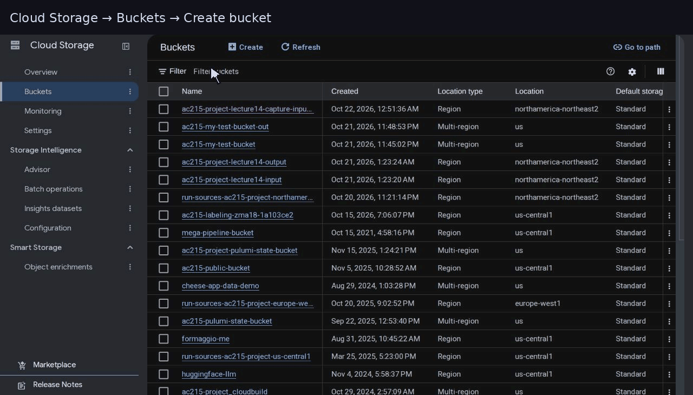

This records the complete output-bucket creation, including each **Continue**,
**Create**, the public-access-prevention **Confirm** dialog, and the resulting
bucket configuration. Repeat the same process for your input bucket. The GIF creates a separate
instructor capture bucket; later upload/job GIFs use the instructor’s established
input/output buckets. Use your worksheet’s two names consistently throughout.

</details>

<details open>
<summary>Watch GIF — upload a passage and find its Storage URI</summary>

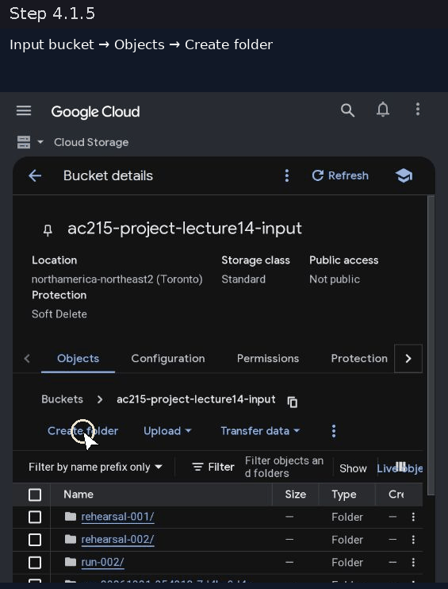

This records actual folder creation, **Upload → Upload files**, successful upload,
opening `passage.txt`, and copying that same object’s URI under `run-001`. A
labeled static navigation detail locates the **Live object** tab above the
recorded scroll position. The system
file picker is represented by its selection instruction; the upload itself was
performed and its completion is shown.

</details>

<details>
<summary>Equivalent gcloud commands — create buckets and upload the first passage</summary>

Choose your own globally unique bucket names; keep these variables for the
remaining job command boxes.

```bash
export INPUT_BUCKET=YOUR_GLOBALLY_UNIQUE_INPUT_BUCKET
export OUTPUT_BUCKET=YOUR_GLOBALLY_UNIQUE_OUTPUT_BUCKET

gcloud services enable storage.googleapis.com --project="$PROJECT_ID"
gcloud storage buckets create "gs://$INPUT_BUCKET" \
  --project="$PROJECT_ID" --location="$REGION" \
  --uniform-bucket-level-access --public-access-prevention
gcloud storage buckets create "gs://$OUTPUT_BUCKET" \
  --project="$PROJECT_ID" --location="$REGION" \
  --uniform-bucket-level-access --public-access-prevention
gcloud storage cp tutorial/app/examples/passage.txt \
  "gs://$INPUT_BUCKET/run-001/passage.txt" --project="$PROJECT_ID"
```

</details>

### 4.2 Create a separate identity for the job

1. Open **IAM & Admin → Service Accounts → Create service account**. Set the
   account ID to `translation-audio-job`.
2. Grant it **Agent Platform User** and **Service Usage Consumer** on your project,
   as you did for the web account. Record its email.
3. Open the **input bucket → Permissions → Grant access**. Enter the job
   account email in **New principals**. Under **Assign roles**, select
   **Storage Object Viewer**, then select **Save**.
4. Open the **output bucket → Permissions → Grant access**. Enter the same job
   account in **New principals**, select **Storage Object Creator**, and select
   **Save**.
5. Leave the web app's runtime account unchanged. It does not need these bucket
   permissions, because its audio goes straight to the browser.

**Checkpoint:** the job account can read input, call the speech model, and create
output files. Your own console/CLI identity needs separate permission to upload
passages, launch executions, and read results.

<details open>
<summary>Watch GIF — give the job read and write permissions</summary>

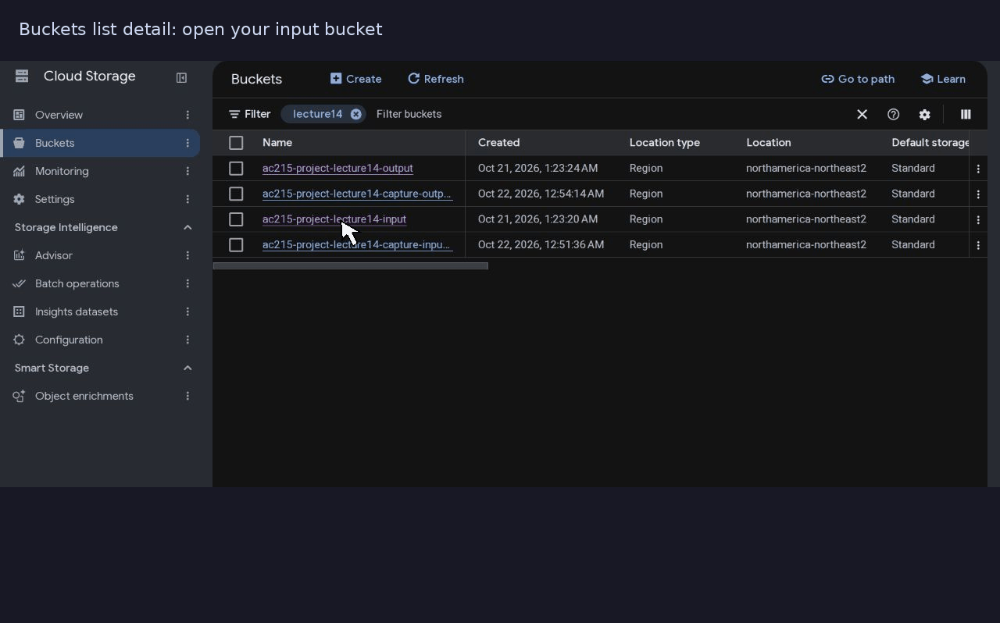

This records the complete **Permissions → Grant access → Save** flow for both
buckets. It grants **Storage Object Viewer** on the input and **Storage Object
Creator** on the output for the job account, preserving other principals’ grants.

</details>

<details>
<summary>Equivalent gcloud commands — grant the job's runtime permissions</summary>

```bash
gcloud iam service-accounts create translation-audio-job \
  --project="$PROJECT_ID" --display-name='Translation audio job'
gcloud projects add-iam-policy-binding "$PROJECT_ID" \
  --member="serviceAccount:$JOB_EMAIL" --role=roles/aiplatform.user --condition=None
gcloud projects add-iam-policy-binding "$PROJECT_ID" \
  --member="serviceAccount:$JOB_EMAIL" \
  --role=roles/serviceusage.serviceUsageConsumer --condition=None
gcloud storage buckets add-iam-policy-binding "gs://$INPUT_BUCKET" \
  --member="serviceAccount:$JOB_EMAIL" --role=roles/storage.objectViewer
gcloud storage buckets add-iam-policy-binding "gs://$OUTPUT_BUCKET" \
  --member="serviceAccount:$JOB_EMAIL" --role=roles/storage.objectCreator
```

For a restricted project, your caller also needs **Service Account User** on the
job account to attach it. Running with argument overrides requires
`run.jobs.runWithOverrides`, supplied by **Cloud Run Jobs Executor With
Overrides**. This is separate from the job account's Agent Platform and Storage access.

</details>

### 4.3 Create the job

Your signed-in deployment identity needs **Service Account User** on the job
account to attach it. The runtime account’s own roles do not grant you that
deployment permission.

1. Open **Cloud Run → Jobs** and select **Deploy container**. The page is
   titled **Create job**.
2. Paste the same public image used in part 2:

   ```text
   cgumb/ac215-translation-demo:lecture14-agent-platform-20261022
   ```

3. Set **Job name** to `translation-audio`, choose your region, and use **1 task**.
4. Expand **Containers, Connections, Security** and open **Containers**. If the
   container row is collapsed, expand its chevron. In **Edit Container → Settings**, enter `python` in **Container command**, then press
   **Enter** to create its chip. This replaces the image's web-server command.
5. In **Container arguments**, enter the following as **individual arguments**,
   replacing the two bucket placeholders. Type one value and press **Enter**
   to create its chip before entering the next. Do not paste the whole block
   into one argument field.

   ```text
   -m
   translation_demo
   batch
   --input-uri
   gs://YOUR_INPUT_BUCKET/run-001/passage.txt
   --src
   en
   --dest
   fr
   --output-uri
   gs://YOUR_OUTPUT_BUCKET/run-001/
   ```

6. In **Edit Container**, select **Variables & Secrets**. Under **Environment
   variables**, select **Add variable** for each row and fill its **Name** and
   **Value**. Select **Done** after adding all three:

   | Name | Value |
   | --- | --- |
   | `ENABLE_SPEECH` | `true` |
   | `GOOGLE_CLOUD_PROJECT` | Your project ID |
   | `GOOGLE_CLOUD_LOCATION` | `us-central1` |

7. Under **Task capacity**, set **Task timeout** to `5`, **Time unit** to
   **minute**, and **Number of retries per failed task** to `0`. Keep **Memory**
   at **512 MiB**, **CPU** at **1**, and **Number of tasks** at `1`.
8. Select the **Security** tab. In **Service account**, choose
   `translation-audio-job@YOUR_PROJECT_ID.iam.gserviceaccount.com` by its email.
   The selector displays the account’s name, which may differ from its ID.
9. Leave **Execute job immediately** unchecked and select **Create**. We will
   launch it explicitly next.

<details open>
<summary>Watch GIF — job image, command, and individual arguments</summary>

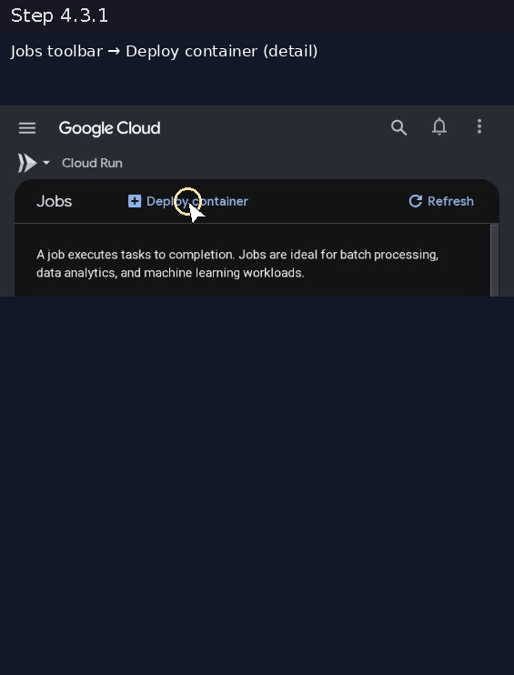

This records a fresh job creation with the tutorial name. Labeled static
navigation details locate **Containers** and the container-row chevron; expand
the row only if it is collapsed. Enter each argument separately and substitute
your own bucket paths. The continuation below records the variables, **Done**,
identity, limits, and final **Create** action.

</details>

<details open>
<summary>Watch GIF — job environment, runtime identity, and task limits</summary>

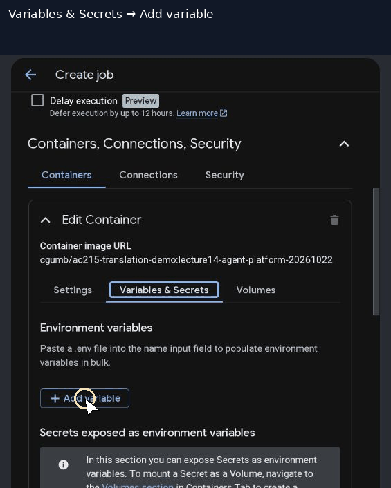

This continues the same creation: variables, **Done**, limits, identity, and
**Create**, followed by the new job’s empty **History**. “Not saved” can remain
on the container card after **Done** until the whole job is created. Keep
**Execute job immediately** unchecked so the next step launches it explicitly.

</details>

<details>
<summary>Equivalent gcloud commands — create the job</summary>

```bash
gcloud run jobs create "$JOB_NAME" \
  --project="$PROJECT_ID" --region="$REGION" --image="$IMAGE" \
  --service-account="$JOB_EMAIL" --command=python \
  --args="-m,translation_demo,batch,--input-uri,gs://$INPUT_BUCKET/run-001/passage.txt,--src,en,--dest,fr,--output-uri,gs://$OUTPUT_BUCKET/run-001/" \
  --set-env-vars="ENABLE_SPEECH=true,GOOGLE_CLOUD_PROJECT=$PROJECT_ID,GOOGLE_CLOUD_LOCATION=us-central1" \
  --tasks=1 --max-retries=0 --task-timeout=300 --memory=512Mi --cpu=1
```

</details>

### 4.4 Execute it and collect the files

1. Open **Cloud Run → Jobs → translation-audio** and select **Execute**. On a
   narrow toolbar, open **More actions** (⋮) to find **Execute**.
2. Wait for the green success check in **History**, then open the new execution. On
   **Tasks**, select **View logs**; scroll the table horizontally if that column
   is off-screen. The logs show completion, the execution ID, and its exact
   `output_uri`. The job exits; it does not provide a web URL.
3. Open **Cloud Storage → Buckets → your output bucket → run-001**. Open the
   uniquely named attempt folder inside it.
4. You should see:

   | File | What it contains |
   | --- | --- |
   | `translated.txt` | The complete translated passage |
   | `speech.wav` | Its generated audio |
   | `manifest.json` | Completion status and output locations |

5. Use the object list’s download icons to retrieve the text and WAV. Depending
   on your browser, these may open in new tabs. Read the translated text there.
   If the WAV opens in a media tab, select **Play**, then **⋮ → Download** to
   save it locally. Part 4.5 shows how to download the whole output folder from
   the terminal.

**Checkpoint:** the task finished, the process stopped, and its files remain in
Storage. This is the payoff of a job: collect the outputs later, without keeping
a browser request open.

<details open>
<summary>Watch GIF — execution history and saved results</summary>

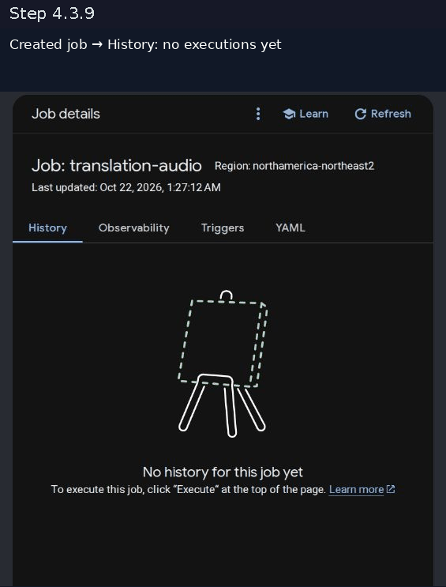

This records a fresh console execution, `translation-audio-hq9f5`, its successful
task logs, and its own `run-001/de2f41…/` output folder. It includes navigating to
Storage, opening that attempt, and opening the actual text and audio. The
media-tab **⋮ → Download** action selects the WAV download. Use your own execution
and attempt IDs; waiting time is shortened. Some static navigation controls are
shown as cropped details to keep their labels readable.

</details>

<details>
<summary>Equivalent gcloud commands — execute, then download</summary>

```bash
gcloud run jobs execute "$JOB_NAME" \
  --project="$PROJECT_ID" --region="$REGION" --wait
mkdir -p results
gcloud storage cp --recursive "gs://$OUTPUT_BUCKET/run-001" ./results \
  --project="$PROJECT_ID"
```

`--wait` waits for completion; it does not stream application logs. If execution
fails, inspect the job's logs instead of assuming that partial output is complete.

</details>

<details>
<summary>More detail — folder names, partial failures, retries, and document limits</summary>

`run-001` is a prefix you selected in the job arguments, not an automatically
numbered directory. Each attempt adds a random UUID folder beneath that prefix.
Re-executing the same job configuration therefore creates another attempt folder
without overwriting previous output. Storage displays these object-name prefixes
as folders; they are not directories on the container's local filesystem.

Each upload uses a create-only generation precondition. The app writes
`manifest.json` with `status: complete` **last**. Partial text/audio files without
a completion manifest do not establish success. Automatic retries can duplicate
paid processing and leave incomplete attempt folders; unique names are not
exactly-once processing. Keep retries at zero for the first walkthrough.

The demo reads a short UTF-8 passage and translates it as a whole, preserving
more context than translating isolated poem lines. Input is limited to 5,000
characters and a 20,000-byte Storage object; speech input is limited to 4,000
UTF-8 bytes after translation. Long-document chunking and parallel tasks are
extensions, not features required for this example.

[Job creation reference](https://docs.cloud.google.com/run/docs/create-jobs).

</details>

### 4.5 Submit another passage from the terminal

Your signed-in user needs permission to execute the job **with overrides**
(`run.jobs.run` and `run.jobs.runWithOverrides`), as well as upload access to the
input bucket and read access to the output bucket. These are developer
permissions, separate from the job runtime account’s read/create permissions.


Once the job exists, you can submit new work without returning to the console.
The upload and execution are separate operations: a remote container cannot read
a filename on your laptop.

1. If you followed only the console path, expand **Terminal setup** near the top
   now. Set the two bucket variables to the actual names you created:

   ```bash
   export INPUT_BUCKET=YOUR_INPUT_BUCKET
   export OUTPUT_BUCKET=YOUR_OUTPUT_BUCKET
   ```

2. Save a new short UTF-8 passage as `passage.txt` on your laptop and upload it:

   ```bash
   gcloud storage cp ./passage.txt "gs://$INPUT_BUCKET/run-002/passage.txt" \
     --project="$PROJECT_ID"
   ```

3. Execute the **existing** job with new argument overrides:

   ```bash
   gcloud run jobs execute "$JOB_NAME" \
     --project="$PROJECT_ID" --region="$REGION" \
     --args="-m,translation_demo,batch,--input-uri,gs://$INPUT_BUCKET/run-002/passage.txt,--src,en,--dest,es,--output-uri,gs://$OUTPUT_BUCKET/run-002/" \
     --wait
   ```

4. After it succeeds, download the new output folder:

   ```bash
   mkdir -p results
   gcloud storage cp --recursive "gs://$OUTPUT_BUCKET/run-002" ./results \
     --project="$PROJECT_ID"
   ```

This run translates into Spanish, using a new input path and output prefix.
Argument overrides replace the complete argument list for this execution; the
job's saved defaults still point to the first French example. Use a fresh prefix
for each new submission.

<details open>
<summary>Watch GIF — terminal upload, execution, and download</summary>

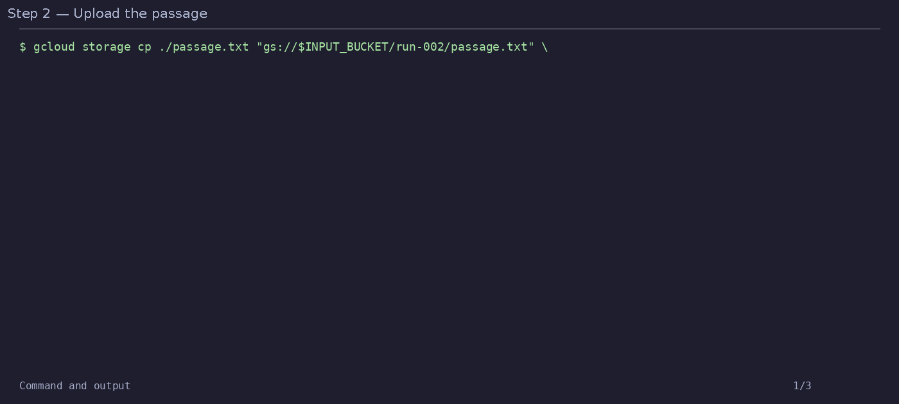

This animates the actual command transcripts for the steps above: upload,
successful Spanish job execution, and download. The displayed project and bucket
names are rehearsal examples; substitute your own values.

</details>

### 4.6 Combine upload, execution, and download with the helper

Now that you have seen the underlying steps, use the local helper to combine
them. From the repository root, run:

```bash
python tutorial/run_job.py ./passage.txt \
  --project="$PROJECT_ID" --region="$REGION" --job="$JOB_NAME" \
  --input-bucket="$INPUT_BUCKET" --output-bucket="$OUTPUT_BUCKET" \
  --src=en --dest=fr --download-dir=./results
```

The helper prints each gcloud command, uploads the file, waits for the job to
succeed, downloads its output, and checks for the completion manifest and files.
Open the reported local result folder and play `speech.wav` inside its attempt
folder. You have submitted cloud work and retrieved the result from your laptop.

<details open>
<summary>Watch GIF — the helper combines the three commands</summary>

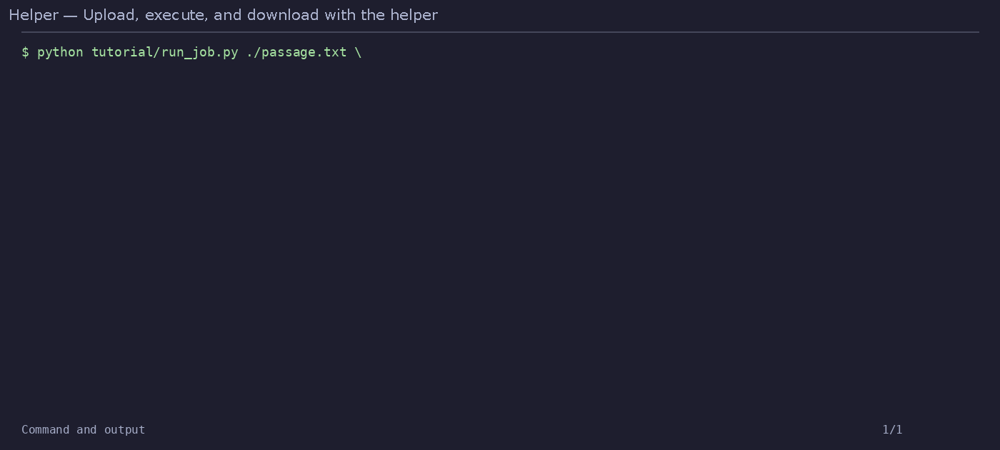

This animates a complete, actual helper invocation: upload, successful French
job execution and download. It prints `Downloaded results` only after finding
a complete manifest. All command output is retained; the animation presents the saved terminal transcript.

</details>

<details>
<summary>More detail — helper options, naming, and authentication</summary>

- `--dry-run` prints commands without uploads, executions, or local file writes.
- `--no-download` leaves outputs in Storage.
- `--help` lists all options. Supply bucket **names**, without `gs://`.
- The helper generates a run name from a UTC timestamp plus a short random ID,
  used in both buckets. The job adds its separate UUID attempt folder. The
  helper does not currently accept a custom run-name prefix.
- Python and a signed-in gcloud CLI are enough for this helper; it does not
  require the app's Python packages or local application ADC. The cloud job
  obtains ADC from its attached runtime account.
- An upload or execution failure stops the helper before later steps. It retains
  cloud files and partial local downloads for inspection, rather than deleting
  them automatically. A new invocation allocates a new run folder.

For a fuller command reference, see the [job workflow guide](docs/job-workflow.md).

</details>

## Clean up after the tutorial

1. Download any results you want to keep.
2. In **Cloud Run**, delete the function and web service you created, then delete
   the job under **Jobs**. Check the names against your worksheet.
3. In **Cloud Storage**, delete your tutorial input/output objects and buckets
   when you no longer need them. Remove the dedicated tutorial service accounts
   after they are no longer attached to resources.
4. A source-built function also leaves an image in Artifact Registry. Remove its
   unused image when appropriate. Keep unrelated course resources and the shared
   public tutorial image available for others.

## Troubleshooting and further reading

<details>
<summary>Something failed — where to look first</summary>

| Symptom | Check |
| --- | --- |
| A resource is missing | Project ID and region in the console; full bucket name |
| Function build fails | Build logs, runtime, requirements, entry point, and build-account permissions |
| Text translation fails | Service logs and external translation provider availability |
| Play audio is disabled | `ENABLE_SPEECH=true`, deployed revision, and page reload |
| Speech request is denied | Attached identity, Agent Platform API, inference/quota permissions, model location |
| A local app cannot authenticate | Application ADC setup, impersonation permission, credential mount if containerized |
| Job cannot read or write an object | Exact `gs://` paths and bucket grants for the **job** account |
| Job starts a server instead of finishing | Command `python` and separate batch arguments |
| Output folder is empty or incomplete | Execution status, logs, and whether a completion manifest exists |
| Helper cannot launch with overrides | Your gcloud caller's override permission, not the runtime account's Storage role |

[Function deployment](https://docs.cloud.google.com/run/docs/quickstarts/functions/deploy-functions-console),
[container deployment](https://docs.cloud.google.com/run/docs/deploying),
[service identity](https://docs.cloud.google.com/run/docs/configuring/services/service-identity),
[job execution](https://docs.cloud.google.com/run/docs/execute/jobs).

</details>

<details>
<summary>For instructors and contributors — source, rehearsal records, and image version</summary>

The source and build instructions live in the
[application development guide](tutorial/app/README.md). Source inspection is
optional for the deployment walkthrough. The helper is
[`tutorial/run_job.py`](tutorial/run_job.py). To create or reset an isolated
rehearsal stack using gcloud, use the [spin-up and teardown guide](docs/lifecycle.md).
Both lifecycle scripts preview their actions by default and track the resources
they own in a local manifest.

The public image's tested Linux AMD64 digest is:

```text
sha256:c17b6db09f7402febb582bf327920ec9ca4eee113f5ddefa38e9da5619dbe72e
```

It is published under a temporary personal Docker Hub namespace until the
maintainer has course-organization publishing access. Students supply their own
project, runtime accounts, and buckets; the image contains no instructor
credentials. The earlier private Artifact Registry rehearsal image is not the
student distribution path.

The instructor confirmed local and cloud browser playback. Automated live
rehearsals covered public image pull, service translation/speech, two direct job
executions, output retrieval, and the combined helper. The console click-through
still deserves an instructor rehearsal; button labels can vary as Google updates
the UI. Command alternatives have been checked against the matching documentation,
but not every alternative was separately executed on a new student project.

- [Current recording coverage](docs/console-gif-coverage.md)
- [Audit findings and resolutions](docs/console-audit-resolution.md)
- [Earlier console function rehearsal record](docs/function-rehearsal.md)
- [Earlier Cloud Run rehearsal record](docs/cloud-run-rehearsal.md)
- [Earlier job and helper rehearsal record](docs/job-rehearsal.md)
- [Historical teaching-flow review](docs/flow-review-opus55.md)
- [Historical original tutorial](docs/original-tutorial.md)

GitHub's native
[collapsed sections](https://docs.github.com/en/get-started/writing-on-github/working-with-advanced-formatting/organizing-information-with-collapsed-sections)
keep command alternatives and deeper explanations expandable in this README.

</details>
