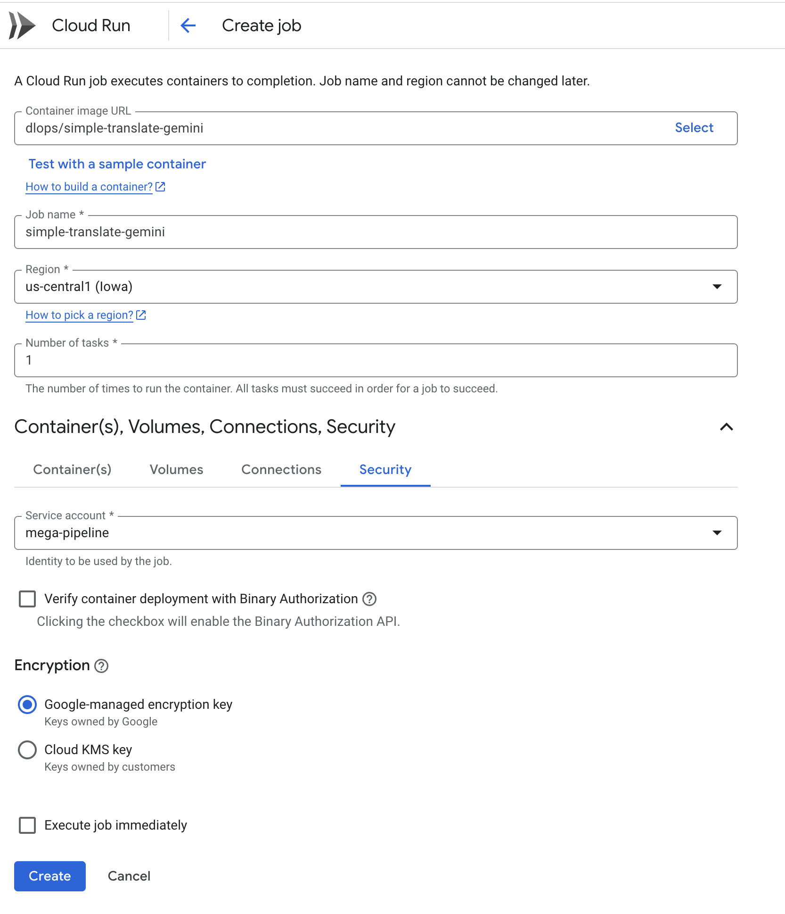

# Serverless Deployment

In this demo we use the Simple Translate App and deploy it to GCP using various Serverless options

## Running App as Cloud Function

### Setup Cloud Function
* In GCP go to [Cloud Run -> Functions](https://console.cloud.google.com/functions)
* Click the "{...} Write a function" button
* If you have not enabled the required APIs, a popup will showup as shown


* Enable the required APIs. Click "ENABLE"

### Create a Cloud Function
* In the Create Cloud Function screen (Create service)
* Under the Configure -> "Service Name" add a name.
* Under Endpoint URL -> "Runtime", select "Python 3.10"
* Under the Authentication section. Select "Allow public access"
* Click "Create" button at the bottom
* 
* Replace the code in `main.py` with the following:
```
import functions_framework
from googletrans import Translator

@functions_framework.http
def hello_http(request):
    """HTTP Cloud Function.
    Args:
        request (flask.Request): The request object.
        <https://flask.palletsprojects.com/en/1.1.x/api/#incoming-request-data>
    Returns:
        The response text, or any set of values that can be turned into a
        Response object using `make_response`
        <https://flask.palletsprojects.com/en/1.1.x/api/#flask.make_response>.
    """
    request_json = request.get_json(silent=True)
    request_args = request.args

    print("request_json:", request_json)
    print("request_args:", request_args)

    translator = Translator()

    text = "Welcome to AC215. Everyone knows the moon is made out of cheese"
    src = "en"
    dest = "es"
    if request_args and 'text' in request_args:
        text = request_args['text']
    if request_args and 'src' in request_args:
        src = request_args['src']
    if request_args and 'dest' in request_args:
        dest = request_args['dest']
    
    results = translator.translate(text, src=src, dest=dest)
    print("Output:", results.text)
    

    return results.text
```

* Replace the content of `requirements.txt` with the following:
```
functions-framework==3.*
googletrans==4.0.0rc1
```

* Click on "Save and Deploy" to deploy the code as a CLoud Function
* Deployment will take a few minutes to complete

### Test Cloud Function

* Get the URL of the Cloud Function from the function details page
* The endpoint should looks like: `https://us-central1-ac215-project.cloudfunctions.net/simple-translate` 
* Test the URL by going to your [Endpoint URL](https://us-central1-ac215-project.cloudfunctions.net/simple-translate)
* Add some parameters and  test again with:
    - text="Good afternoon everyone" src=en dest=fr, add `?text=Good afternoon everyone&src=en&dest=fr` to the url  [Endpoint](<https://us-central1-ac215-project.cloudfunctions.net/simple-translate?text=Good afternoon everyone&src=en&dest=fr>)
    - text="Very cool concept" src=en dest=el, add `?text=Very cool concept&src=en&dest=el` to the url [Endpoint](<https://us-central1-ac215-project.cloudfunctions.net/simple-translate?text=Very cool concept&src=en&dest=el>)
    - text="Ready to go home?" src=en dest=hi, add `?text=Ready to go home?&src=en&dest=hi` to the url [Endpoint](<https://us-central1-ac215-project.cloudfunctions.net/simple-translate?text=Ready to go home?&src=en&dest=hi>)


<hr> 

<hr> 

## Running App in Cloud Run

### Setup Cloud Run (Service)
* In GCP go to [Cloud Run](https://console.cloud.google.com/run)
* Click the "Deploy container"
* If you have not enabled the required APIs, a popup will showup

### Deploy Container
* Select the "Deploy one revision from an existing container image" and put in the image name: `dlops/simple-translate-http:latest`
* Give you Cloud Run a `Service name`
* Under Authentication, select "Allow public access"
* Click "Create" and the docker image will be deployed as a Cloud Run
* Your screen should look like this:


* Deployment will take a few minutes to complete

### Test Cloud Run

* Get the URL of the Cloud Run from the service details page
* The endpoint should looks like: `https://simple-translate-run-ckilfntmda-uc.a.run.app` 
* Test the URL by going to your [Endpoint URL](https://simple-translate-run-ckilfntmda-uc.a.run.app)
* Add some parameters and  test again with:
    - text="Good afternoon everyone" src=en dest=fr, add `?text=Good afternoon everyone&src=en&dest=fr` to the url  [Endpoint](<https://simple-translate-run-ckilfntmda-uc.a.run.app?text=Good afternoon everyone&src=en&dest=fr>)
    - text="Very cool concept" src=en dest=el, add `?text=Very cool concept&src=en&dest=el` to the url [Endpoint](<https://simple-translate-run-ckilfntmda-uc.a.run.app?text=Very cool concept&src=en&dest=el>)
    - text="Ready to go home?" src=en dest=hi, add `?text=Ready to go home?&src=en&dest=hi` to the url [Endpoint](<https://simple-translate-run-ckilfntmda-uc.a.run.app?text=Ready to go home?&src=en&dest=hi>)


<hr> 

<hr> 

## Setup Cloud Run (Job + Service Account)
* In GCP go to [Cloud Run](https://console.cloud.google.com/run)
* Click the "Deploy container" and pick "Job"

In the Create job screen fill in the following details:

* Container Image URL: dlops/simple-translate-gemini
* Job name: Give a unique job name
* Expand the section for "Container(s), Volumes, Connections, Security"
* Select "SECURITY" tab and pick the right "Service Account" that has access to Vertex AI (Gemini) API
* Select the check box "Execute job immediately"

Here are the details for creating a job:



This will run the simple-translate container using the default arguments. If you want to pass arguments:
* Select "CONTAINER(S)" tab and in the SETTINGS area
* For Container arguments type in: cli.py --text Ready+to+go+home?

Here are the details for running a job with container arguments:


